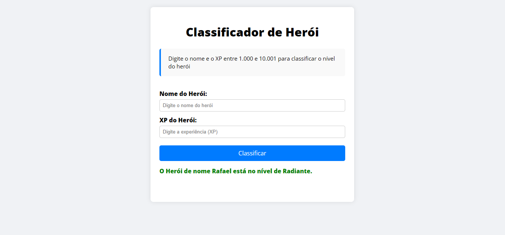

# ⚔️ Desafio: Classificador de Nível de Herói
**Projeto:** Este repositório contém a solução do desafio Classificador de Nível de Herói da DIO. O objetivo é receber o nome e a quantidade de experiência (XP) de um herói, e, com base em uma estrutura de decisão, classificar o nível do personagem de acordo com a tabela de faixas de XP.

# 🎯 Deploy do Desafio
🔗 [Clique aqui para acessar a página](https://discord-css-dio.netlify.app/)



# 🗂️ Estrutura do Projeto

```
📁 .github
 ┗ 📄 preview.png              
📁 css
 ┗ 📄 styles.css
📁 js
 ┗ 📄 index.js
📄 index.html                 
📄 README.md   
```
# 🖥️ Tecnologias Utilizadas
- HTML5
- CSS3
- JavaScript

# 📌 Regras do Desafio
### O que deve ser utilizado:

- Variáveis
- Operadores
- Laços de repetição
- Estruturas de decisões

### Objetivo:

Armazenar o nome e a quantidade de experiência (XP) de um herói, depois utilizei uma estrutura de decisão para apresentar alguma das mensagens abaixo:

```
- Se XP for menor do que 1.000 = Ferro

- Se XP for entre 1.001 e 2.000 = Bronze

- Se XP for entre 2.001 e 5.000 = Prata

- Se XP for entre 5.001 e 7.000 = Ouro

- Se XP for entre 7.001 e 8.000 = Platina

- Se XP for entre 8.001 e 9.000 = Ascendente

- Se XP for entre 9.001 e 10.000 = Imortal

- Se XP for maior ou igual a 10.001 = Radiante
```
### Saída Esperada:
```
"O Herói de nome {nome} está no nível de {nivel}"
```

## 🔗 Links de Referência

- [Plataforma DIO](https://web.dio.me/)
- [Deploy Netlify](https://discord-css-dio.netlify.app/)

## 👨‍💻 Autor

- Desenvolvido por [Rafael Moreira](https://github.com/RafaeltiMoreira)